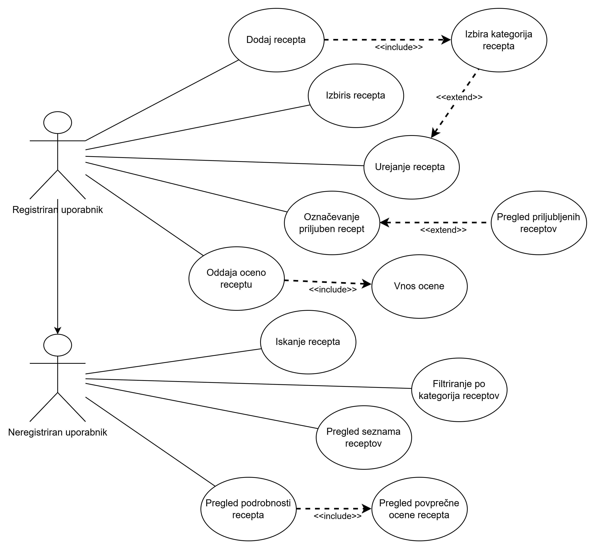

<h1 align="center">RecipeVWR</h1>
<p align="center">
  Discover, organize, and share your favorite recipes with ease.
</p>

<p align="center">
  <a href="https://react.dev/"></a>
  <a href="https://www.typescriptlang.org/"></a>
  <a href="https://tailwindcss.com/"></a>
  <a href="https://vitejs.dev/"></a>
  <a href="https://bun.sh/"></a>
  <a href="https://spring.io/projects/spring-boot"></a>
  <a href="https://www.docker.com/"></a>
  <a href="https://www.postgresql.org/"></a>
  <a href="https://www.java.com/"></a>
  <a href="https://maven.apache.org/"></a>
  <a href="https://git-scm.com/"></a>
</p>

## 📝 Description

RecipeVWR is a modern web application built with React and TypeScript, designed to help you discover, organize, and share your favorite recipes. While currently under development and focusing on robust testing, RecipeVWR aims to provide a seamless user experience with features for searching recipes, creating personal cookbooks, and contributing your own culinary creations to the community. Stay tuned for updates as we continue to build and refine RecipeVWR into the ultimate recipe management tool.

## Vision

Our application allows users to add their own recipes, browse existing ones, and easily search through different categories. With a simple design, the app quickly helps users find ideas for preparing meals. The purpose of the application is to simplify searching, enable knowledge sharing, and create a pleasant space for exchanging recipes.

## 🛠️ Tech Stack

### **Frontend**

| Technology   | Version | Purpose                          |
| ------------ | ------- | -------------------------------- |
| React        | 19.1.1  | UI library                       |
| TypeScript   | 5.x     | Strongly typed JS                |
| Tailwind CSS | 4.1.14  | Utility-first CSS                |
| Vite         | 4.x     | Frontend build tool & dev server |
| Bun          | Latest  | Package manager & runtime        |

### **Backend**

| Technology      | Version | Purpose                       |
| --------------- | ------- | ----------------------------- |
| Spring Boot     | 3.5.6   | REST API framework            |
| Java            | 17      | Backend language              |
| Spring Data JPA | 3.x     | Database access               |
| Maven           | 3.x     | Dependency management & build |
| Lombok          | 1.18.x  | Reduce boilerplate code       |
| Docker          | Latest  | Containerization & deployment |

### **Database**

| Technology | Version | Purpose             |
| ---------- | ------- | ------------------- |
| PostgreSQL | 15.x    | Relational database |
| Port       | 5432    | Database connection |

### **Development Tools**

| Tool           | Version | Purpose                          |
| -------------- | ------- | -------------------------------- |
| Docker Compose | 3.9     | Orchestrate multi-container apps |
| Git            | Latest  | Version control                  |

## 🖋️ Coding Standards & Framework Decisions

### **Coding Standards**

**Frontend**

- **React Components**: Use `PascalCase` for component names, `camelCase` for props and state.
- **TypeScript**: Strict mode enabled; always type props and function returns.
- **Tailwind CSS**: Follow consistent utility ordering and BEM-style naming for custom classes.
- **Linting & Formatting**: Run `eslint --fix` and `prettier` before committing.

**Backend**

- **Java Naming Conventions**: `PascalCase` for classes, `camelCase` for methods and variables.
- **Spring Boot Structure**: Controllers handle HTTP requests; services handle business logic; repositories handle database access.
- **Annotations**: Use consistently (`@RestController`, `@Service`, `@Repository`).
- **Tests & Build**: Run `mvn clean install` to verify code compiles and tests pass.

**General**

- **Commit Messages**: Use Conventional Commits style: `feat:`, `fix:`, `docs:`.
- **Code Reviews**: Ensure code is readable, tested, and follows project style guidelines.

### **Framework / Tool Decisions**

- **Bun over npm**: Bun is used as the package manager and runtime for faster installs and improved performance during development.
- **Tailwind CSS**: Chosen for utility-first styling that allows rapid UI development while keeping CSS maintainable and consistent.
- **Vite**: Lightweight, fast build tool that provides hot module replacement and optimized builds for the frontend.
- **Spring Boot**: Provides a robust backend framework with integrated support for REST APIs, JPA, and dependency management via Maven.

## 📦 Key Dependencies

```
@gsap/react: ^2.1.2
@heroicons/react: ^2.2.0
@tailwindcss/vite: ^4.1.14
axios: ^1.12.2
gsap: ^3.13.0
react: ^19.1.1
react-dom: ^19.1.1
sonner: ^2.0.7
tailwindcss: ^4.1.14
```

## 🚀 Run Commands

- **dev**: `npm run dev`
- **build**: `npm run build`
- **lint**: `npm run lint`
- **preview**: `npm run preview`

## 📁 Project Structure

```
.
├── ris-backend
│   ├── .mvn
│   │   └── wrapper
│   │       └── maven-wrapper.properties
│   ├── mvnw
│   ├── mvnw.cmd
│   ├── pom.xml
│   └── src
│       ├── main
│       │   ├── java
│       │   │   └── um
│       │   │       └── feri
│       │   │           └── si
│       │   │               └── ris_backend
│       │   │                   ├── RisBackendApplication.java
│       │   │                   ├── controller
│       │   │                   │   └── RecipeRestController.java
│       │   │                   ├── model
│       │   │                   │   └── Recipe.java
│       │   │                   ├── repository
│       │   │                   │   └── RecipeRepository.java
│       │   │                   └── service
│       │   │                       └── RecipeService.java
│       │   └── resources
│       │       └── application.properties
│       └── test
│           └── java
│               └── um
│                   └── feri
│                       └── si
│                           └── ris_backend
│                               └── RisBackendApplicationTests.java
└── ris-frontend
    ├── bun.lock
    ├── eslint.config.js
    ├── index.html
    ├── package.json
    ├── public
    │   └── vite.svg
    ├── src
    │   ├── App.tsx
    │   ├── assets
    │   │   └── react.svg
    │   ├── components
    │   │   ├── AddRecipeForm.tsx
    │   │   ├── CategoryToggle.tsx
    │   │   ├── EditRecipeForm.tsx
    │   │   ├── Header.tsx
    │   │   ├── RecipeCard.tsx
    │   │   └── RecipeDash.tsx
    │   ├── index.css
    │   └── main.tsx
    ├── tsconfig.app.json
    ├── tsconfig.json
    ├── tsconfig.node.json
    └── vite.config.ts
```

## Glossary

| Term                  | Description                                                                                                                          |
| --------------------- | ------------------------------------------------------------------------------------------------------------------------------------ |
| **Recipe**            | A collection of ingredients, instructions, title, type of dish, and image.                                                           |
| **Ingredients**       | A list of elements with appropriate units for preparing the recipe.                                                                  |
| **Instructions**      | Steps required to prepare the recipe.                                                                                                |
| **Units**             | Measurement units used in recipes, e.g., ml (milliliters), tbsp (tablespoon), g (grams).                                             |
| **Dish Types**        | Category of the dish, e.g., baked dishes, main courses, or desserts. Recipes can be categorized by type.                             |
| **Login**             | Process where registered users enter their email and password to gain access to the application's functions.                         |
| **Registered User**   | A person who has successfully completed the registration process.                                                                    |
| **Unregistered User** | A person who can view recipes but cannot add, delete, or edit recipes, nor use other application functions.                          |
| **Adding**            | Registered users can add a recipe by entering the title, ingredients, instructions, selecting the dish type, and uploading an image. |
| **Editing**           | Registered users can edit their existing recipes by changing the title, ingredients, or instructions.                                |
| **Sorting**           | Process that allows recipes to be sorted alphabetically or by dish type.                                                             |
| **Favorite Recipes**  | A list of recipes that the registered user has marked as favorites and can easily find and use.                                      |
| **Application Usage** | Actions available in the application, including browsing, adding, deleting, and editing recipes.                                     |

## DPU



## 🛠️ Development Setup

### Node.js/JavaScript Setup

1. Install Node.js (v18+ recommended)
2. Install dependencies using your preferred package manager:
   - With **npm**: `npm install`
   - Or with **Bun** (recommended): `bun install`
3. Start development server:
   - `npm run dev` or `bun run dev`

## 👥 Contributing

Contributions are welcome! Here's how you can help:

1. **Fork** the repository
2. **Clone** your fork: `git clone https://github.com/bagiicpp/RecipeVWR.git`
3. **Create** a new branch: `git checkout -b feature/your-feature`
4. **Commit** your changes: `git commit -am 'Add some feature'`
5. **Push** to your branch: `git push origin feature/your-feature`
6. **Open** a pull request

Please ensure your code follows the project's style guidelines and includes tests where applicable.
